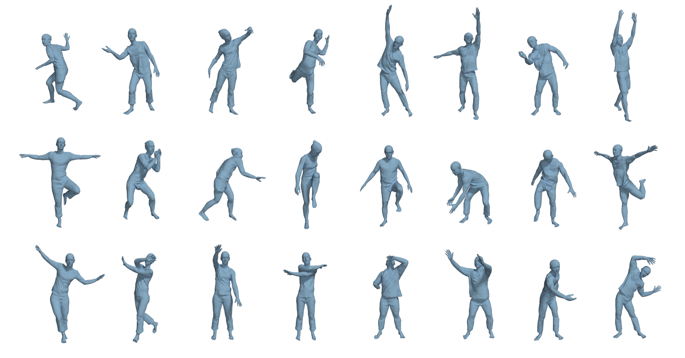

## Official utilities for the CAPE dataset
[](https://cape.is.tue.mpg.de/) [](https://arxiv.org/abs/1907.13615)

### Description

This repository contains the scripts to facilitate using the [CAPE dataset](https://cape.is.tue.mpg.de/dataset), introduced in our CVPR 2020 paper [Learning to Dress 3D People in Generative Clothing](https://arxiv.org/abs/1907.13615). 

The CAPE dataset is a collection of 3D meshes of clothed humans in motion. It consists of 15 subjects, 610 sequences, 148K frames in total. It incorporates the scans and registrations of [ClothCap (SIGGRAPH 2017)](http://clothcap.is.tue.mpg.de/). The data are captured with a hi-res 4D body scanner, and registered to the topology of the [SMPL body model](https://smpl.is.tue.mpg.de). Thanks to its consistent mesh topology, the data are readily applicable for various machine learning tasks, such as explicit / implicit clothing modeling, 3D dynamic shape modeling, graph neural networks, etc.

For more details and to download the entire dataset, please visit our [project website](https://cape.is.tue.mpg.de/).



### Dependencies

- numpy
- trimesh
- tqdm

They can be installed by  `pip3 install -r requirements.txt`. The code has been tested on Ubuntu 18.04 and python 3.6.

### Optional Dependencies 

For visualizing data as videos:
- The [PSBody Mesh package](https://github.com/MPI-IS/mesh). Go to "releases" there and install version 0.3 (not the latest 0.4).
- ffmpeg: for saving the visualization into videos.

### Usage

Clone this repository to the root of the CAPE dataset folder. The following commands assume being launched from the CAPE dataset root.

##### Extract the meshes out of the compressed data

```python
python cape_utils/dataset_utils.py --subj <subject> --seq_name <sequence_name> --option posed --extract
```

The extracted meshes are located in `<cape_root>/meshes/<subject>/<sequence_name>/<option>`.

##### Render the extracted meshes into videos (requires psbody.mesh)

```python
python cape_utils/dataset_utils.py --subj <subject> --seq_name <sequence_name> --option posed --vis_seq
```

The rendered videos are saved as `<cape_root>/visualization/<subject>/<sequence_name>_<option>.mp4`.

##### Visualize the clothing displacements (of a single frame)

```python
python cape_utils/dataset_utils.py --subj <subject> --seq_name <sequence_name> --option posed --demo_disps
```
##### Visualize the raw scans along with their mesh registrations (requires psbody.mesh)
If you have downloaded raw scans of the CAPE datset and organize them as `<cape_root>/raw_scans/<subject>/<sequence_name>/`, you can use the following command to visualize the alignment (overlapping) between the raw scans and their corresponding mesh registrations:

```python
python cape_utils/dataset_utils.py --subj <subject> --seq_name <sequence_name> --mesh_lib psbody.mesh --vis_scans
```

### License

Software Copyright License for **non-commercial scientific research purposes**. Please read carefully the [terms and conditions](./LICENSE) and any accompanying documentation before you download and/or use the CAPE data and software, (the "Dataset & Software"), including 3D meshes, pose parameters, scripts, and animations. By downloading and/or using the Dataset & Software (including downloading, cloning, installing, and any other use of this github repository), you acknowledge that you have read these terms and conditions, understand them, and agree to be bound by them. If you do not agree with these terms and conditions, you must not download and/or use the Dataset & Software. Any infringement of the terms of this agreement will automatically terminate your rights under this [License](LICENSE).

### Citation:

If you find the CAPE dataset useful in your research, please consider citing the CAPE paper and ClothCap paper:

```bibtex
@inproceedings{CAPE:CVPR:20,
  title = {Learning to Dress 3D People in Generative Clothing},
  author = {Ma, Qianli and Yang, Jinlong and Ranjan, Anurag and Pujades, Sergi and Pons-Moll, Gerard and Tang, Siyu and Black, Michael J.},
  booktitle = {Computer Vision and Pattern Recognition (CVPR)},
  month = jun,
  year = {2020},
  month_numeric = {6}
}
```

```bibtex
@article{Pons-Moll:Siggraph2017,
  title = {ClothCap: Seamless 4D Clothing Capture and Retargeting},
  author = {Pons-Moll, Gerard and Pujades, Sergi and Hu, Sonny and Black, Michael},
  journal = {ACM Transactions on Graphics, (Proc. SIGGRAPH)},
  volume = {36},
  number = {4},
  year = {2017},
  note = {Two first authors contributed equally},
  crossref = {},
  url = {http://dx.doi.org/10.1145/3072959.3073711}
}
```

### Contact

The code of this repository is implemented by [Qianli Ma](https://ps.is.tuebingen.mpg.de/person/qma). For questions, please contact cape@tue.mpg.de.

For feature requests and feedbacks, please raise issues to this repository.

